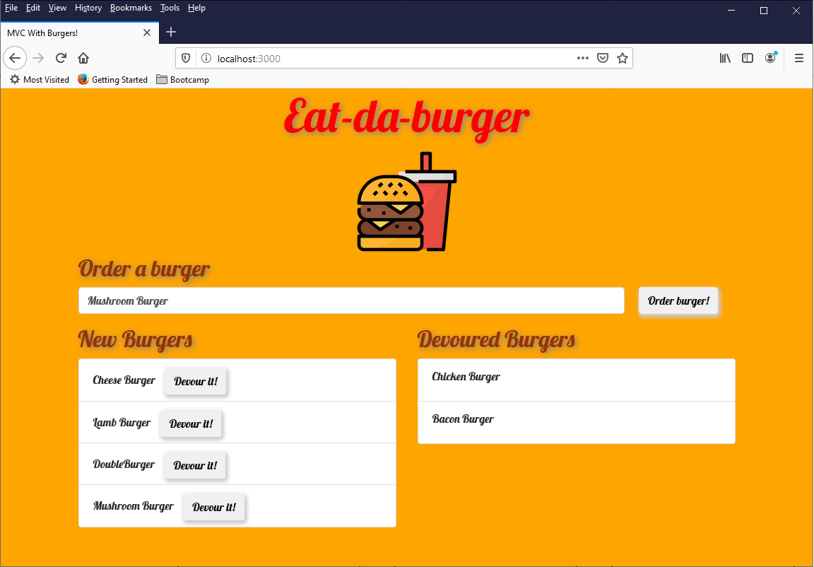

# Burger Tracker
This is a burger tracker. 

# Usage 
Application has been deployed to herorku. 
Access the following URL to open the web application.

1. Enter a name of burger you want to order. 

2. The buger will be listed in the "New burger" section.

3. Click "Devour It!" button to move it to "Devoured Burgers" section. 

Bounus: Hover the mouse over the Burger icon few times or more and see what happens. 

# Credit
Following technologies were used to develop the application.
* Node.js 
* Express.js
* MySQL
* Handlebars
* Bootstrap

Used this free Icon
https://www.flaticon.com/free-icon/fast-food_2503419?term=burger&page=1&position=23

Giphy for GIF animation
https://giphy.com/

